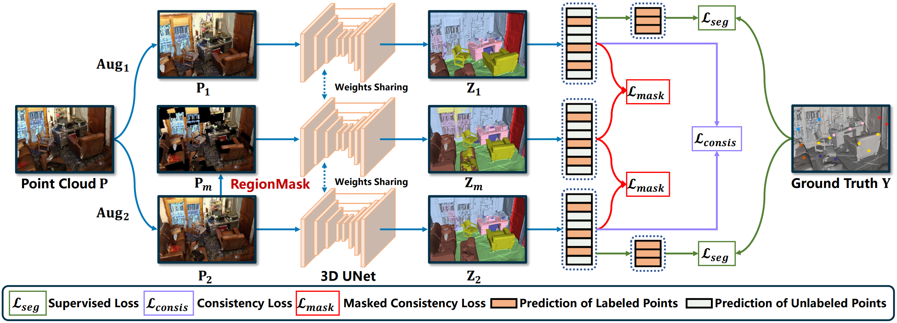
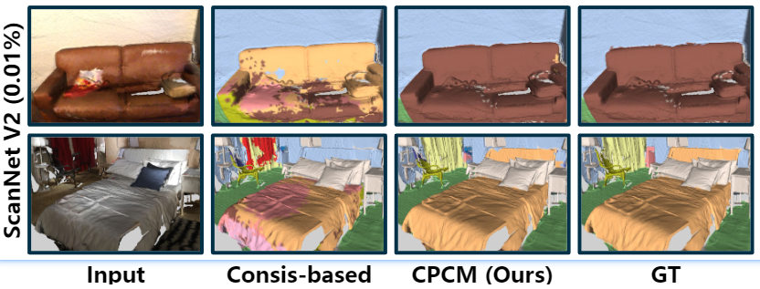
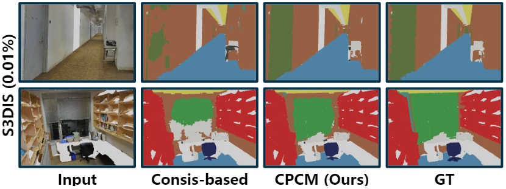

# Contextual Point Cloud Modeling for Weakly-supervised Point Cloud Semantic Segmentation (ICCV 2023)

<p align="center">
  <a href="" target='_blank'>
    
  </a>
  <a href="" target='_blank'>
    
  </a>
</p>

Created by [Lizhao Liu](https://scholar.google.com/citations?user=_AMTrAQAAAAJ&hl=zh-CN), Xunlong Xiao, [Zhuangwei Zhuang](https://scholar.google.com/citations?user=T2aPuoYAAAAJ&hl=zh-CN) from the South China University of Technology.

This repository contains the official PyTorch implementation of our ICCV 2023 paper [*Contextual Point Cloud Modeling for Weakly-supervised Point Cloud Semantic Segmentation*](https://arxiv.org/pdf/2307.10316.pdf).

<br>




## Environment Setup
Our codebase is based on [MinkowskiEngine](https://github.com/NVIDIA/MinkowskiEngine), a high performance sparse convolution library built on PyTorch.

We recommend to use MinkowskiEngine 0.5.4, since it is much faster than 0.4.3

For MinkowskiEngine 0.5.4, see instruction in [me054](prepare_env/me054/README.md)

For MinkowskiEngine 0.4.3, see instruction in [me043](prepare_env/me043/README.md)

## Data Preparation
We perform experiments on the following dataset

- [ScanNet V2](https://kaldir.vc.in.tum.de/scannet_benchmark/)
- [S3DIS](http://buildingparser.stanford.edu/dataset.html)
- [Semantic-KITTI (Front view that contains both RGB and XYZ)](http://www.semantic-kitti.org/)

The preprocessed datasets are shared via google drive

- [ScanNet V2 (6.88G)](https://drive.google.com/file/d/16y5f16RI-X-9q7k1_nG9tDb1aqmmrNQt/view?usp=drive_link)
- [S3DIS (8.82G)](https://drive.google.com/file/d/1wD04uB5znFIcY0fY-7U8Ig3jlSX8uczX/view?usp=drive_link)
- [Semantic-KITTI (3.15G)](https://drive.google.com/file/d/1pxScBQrk5uLrDDoKGgOQ4fcq5yMMrCxX/view?usp=drive_link)

Or see instruction in [Dataset Preparation Hand-by-hand](prepare_dataset/README.md) to prepare by yourself.

## Quantitative Results
All results below are in mIoU(%)
### Experiments on the indoor dataset: ScanNet V2 and S3DIS
<table>
    <tr>
        <td rowspan="2">Method</td>
        <td colspan="2">ScanNet V2</td>
        <td colspan="2">S3DIS</td>
    </tr>
    <tr>
        <td>0.01%</td>
        <td>0.1%</td>
        <td>0.01%</td>
        <td>0.1%</td>
    </tr>
    <tr>
        <td>MinkNet</td>
        <td>37.6</td>
        <td>60.3</td>
        <td>47.7</td>
        <td>62.9</td>
    </tr>
    <tr>
        <td>Consis-based</td>
        <td>44.2 (+6.6)</td>
        <td>61.8 (+1.5)</td>
        <td>52.9 (+5.2)</td>
        <td>64.9 (+2.0)</td>
    </tr>
    <tr>
        <td>CPCM (Ours)</td>
        <td>52.2 (+14.6)</td>
        <td>63.8 (+3.5)</td>
        <td>59.3 (+11.6)</td>
        <td>66.3 (+3.4)</td>
    </tr>
</table>

### Experiments on the outdoor dataset SemanticKITTY (FoV)
<table>
    <tr>
        <td rowspan="2">Method</td>
        <td colspan="3", align="center">SemanticKITTY</td>
    </tr>
    <tr>
        <td>1%</td>
        <td>0.1%</td>
        <td>0.01%</td>
    </tr>
    <tr>
        <td>MinkNet</td>
        <td>37.0</td>
        <td>30.8</td>
        <td>23.7</td>
    </tr>
    <tr>
        <td>Consis-based</td>
        <td>43.7 (+6.7)</td>
        <td>38.8 (+8.0)</td>
        <td>30.0 (+6.3)</td>
    </tr>
    <tr>
        <td>CPCM (Ours)</td>
        <td>47.8 (+10.8)</td>
        <td>44.0 (+13.2)</td>
        <td>34.7 (+11.0)</td>
    </tr>
</table>

## Qualitative Results on ScanNet V2 and S3DIS
<div align=center></div>

## Experiments on S3DIS
To reproduce the results of S3DIS, see experiment scripts [here](scripts/S3DIS.sh) for details.

## Experiments on ScanNet V2
To reproduce the results of ScanNet V2, see experiment scripts [here](scripts/ScanNetV2.sh) for details.

## Experiments on SemanticKITTY (FoV)

:fire: Coming soon!

## Acknowledgement
This codebase is partially built on the [PointContrast](https://github.com/facebookresearch/PointContrast) project.

## Citation
If you find this code helpful for your research, please consider citing
```
@inproceedings{liu2023contextual,
  title={CPCM: Contextual point cloud modeling for weakly-supervised point cloud semantic segmentation},
  author={Liu, Lizhao and Zhuang, Zhuangwei and Huang, Shangxin and Xiao, Xunlong and Xiang Tianhang and Chen, Cen and Wang, Jingdong and Tan, Mingkui},
  booktitle={Proceedings of the IEEE/CVF International Conference on Computer Vision},
  year={2023}
}
```
